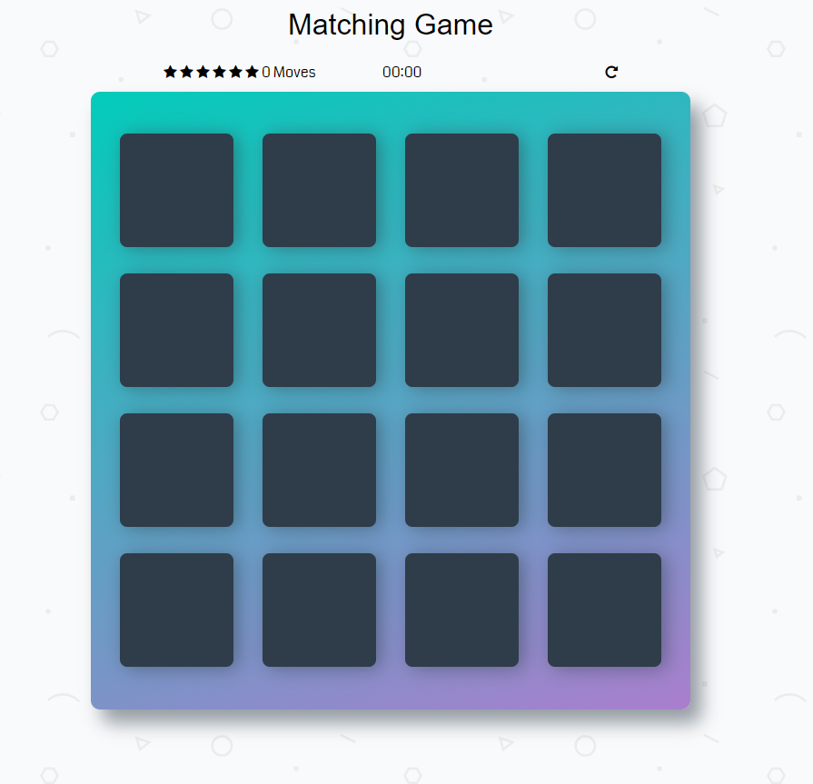
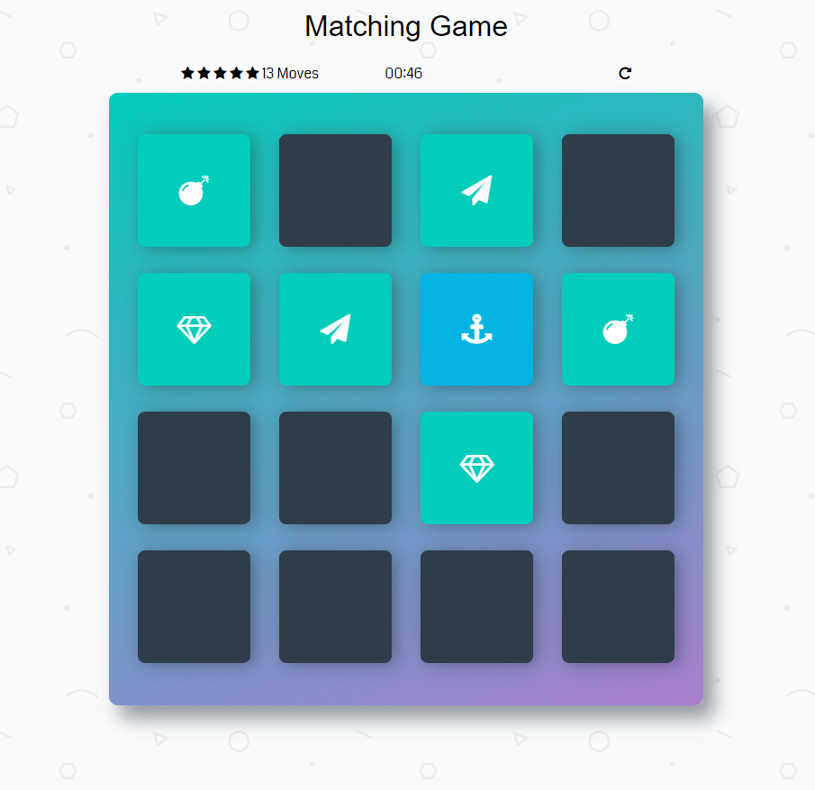

# Matching-Game

Simple Matching-Game app designed as a part of Udacity Front-End Nanodegree program.

## Built With

* HTML
* CSS
* Javascript

### Installing
Just clone/download the project files, and run index.html at your browser of choice.

## Starting State 

## In-Game

## Authors

Alex Karvounis - al3xkarv

## License

This project is licensed under the GNU General Public License v3.0

